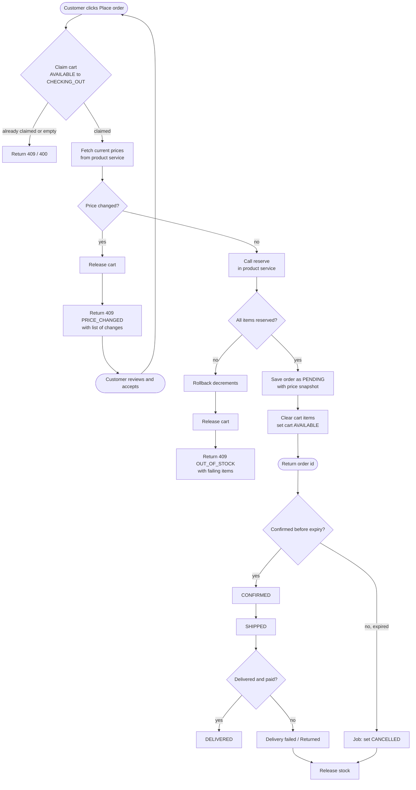

```mermaid
flowchart TD
    A([Customer clicks Place order]) --> B{Claim cart<br/>AVAILABLE to CHECKING_OUT}
    B -- already claimed or empty --> B1[Return 409 / 400]
    B -- claimed --> C[Fetch current prices<br/>from product service]

    C --> D{Price changed?}
    D -- yes --> D1[Release cart]
    D1 --> D2[Return 409 PRICE_CHANGED<br/>with list of changes]
    D2 --> D3([Customer reviews and accepts])
    D3 --> A

    D -- no --> E[Call reserve<br/>in product service]
    E --> F{All items reserved?}
    F -- no --> F1[Rollback decrements]
    F1 --> F2[Release cart]
    F2 --> F3[Return 409 OUT_OF_STOCK<br/>with failing items]

    F -- yes --> G[Save order as PENDING<br/>with price snapshot]
    G --> H[Clear cart items<br/>set cart AVAILABLE]
    H --> I([Return order id])

    I --> J{Confirmed before expiry?}
    J -- yes --> K[CONFIRMED]
    K --> L[SHIPPED]
    L --> M{Delivered and paid?}
    M -- yes --> N[DELIVERED]
    M -- no --> O[Delivery failed / Returned]
    O --> P[Release stock]

    J -- no, expired --> Q[Job: set CANCELLED]
    Q --> P
```